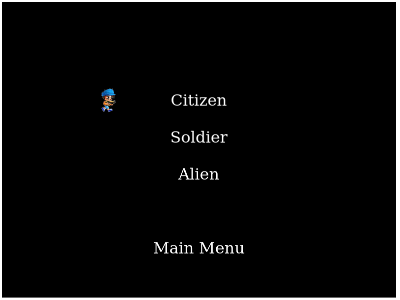

# Alien Invasion

> This project is the Microverse JavaScript Capstone project. It was created using Phaser 3 to be in the style of a Shooter game. It is compiled using webpack and deployed with Netlify. It takes keyboard input, uses multiple scenes, and connects to a LeaderBoard API.

### Features

-   Loading screen progress bar with background art
-   Arrow pointer for easy menu selection
-   Character selection
-   Dynamic level creation every third round
-   Round timer
-   Points awarded for each round cleared
-   Enemies chase player based on x position
-   Enemies jump if the player jumps
-   Options for music/sound to be set on/off
-   LeaderBoard quickplay
-   LeaderBoard connected to LeaderBoard API
-   Credits quickplay
-   Skip buttons for LeaderBoard and Credits scenes

###### Coming Features

-   Additional character / enemy selection
-   Scrollable screen
-   Multi-Player

# Description

The year is 2021. The New Year's celebrations just finished dying down when huge explosions seem to be heard simultaneously around the world. Before you even have time to look up you see bright beams of light shining all over the ground and people, dumbfounded, stare up into them like deer on a dark road. Good thing you have your trusty 'Rusty' shotgun with you. You hear an explosion and see an alien get shot, throwing a grenade before blowing himself up! Soldiers in hardened full-body suits start showing up out of nowhere and you know it's time! It's 2020 part 2: 2021! Alien Invasion!

# Design
## Gameplay
 `^` - Press 'Up' on the directional pad to jump.  
 `<` - Press 'Left' on the directional pad to move left.  
 `>` - Press 'Right' on the directional pad to move right.  
 `SPACE` - Press 'Space' on the directional pad to shoot.   
 `F` - Press the 'F' button on the Title screen or during GamePlay to enter/exit FullScreen mode.  

 ### Mechanics
-   Avoid being shot by enemies
-   Avoid touching bombs
-   Enemies can be destroyed by shooting them
-   Bombs can be destroyed by shooting them
-   Upon touching the ground, enemies begin to chase the player.
-   Enemies jump away if they get too close to the player
-   A timer counts down each round
-   You have 5 seconds to kill the first enemy and 10 seconds for each round afterwards
-   Every round, between 1 - 3 enemies will appear
-   Every third round, the platforms over head rearrange
-   Every other round a bomb drops
-   10 points are given for every round cleared
-   A round is cleared when all enemies are destroyed
-   Luck is just as important as skill in this game!
    #### Enter your name above the game to save your scores. The input will disappear if a name is stored.
-   to reset your username, clear the localStorage or use a new browser

### Scenes
-   Boot
-   Preloader
-   Title
-   Character Selection
-   GamePlay
-   GameOver
-   LeaderBoard
-   Credits
-   Options

## Built With

-   Ubuntu
-   Atom
-   HTML / SCSS / JavaScript / node.js
-   WebPack
-   Phaser3
-   Jest

## Live Demo

Play the game [here](https://quirky-nobel-917e25.netlify.app/)!

## Getting Started
**To get this project set up on your local machine, follow these simple steps:**

#### Prerequisites
 - Node.js4
 - NPM

**Step 1** 
Navigate to the local folder where you want the repository to be cloned and run
`git clone https://github.com/defoebrand/Alien-Invasion.git`. 

**Step 2** 
Next, run `cd Alien-Invasion`. 

**Step 3** 
Run `npm install` to install the packages from the `package.json`. 

**Step 4** 
Run `npm run server` to begin the server. 

**Step 5** 
Navigate to `http://localhost:8080/` in a browser of your choice to see the application running 

### Testing
This project uses Jest for testing.
 - Additional packages required for API tests  
   -- core-js  
   -- regenerator-runtime  
   -- node-fetch
> To run tests open a terminal inside the project's root directory and enter `npm run tests`

## Authors

👤 **Brandon Defoe**

-   Github: [@defoebrand](https://github.com/defoebrand)
-   LinkedIn: [@defoebrand](https://www.linkedin.com/in/defoebrand/)
-   Portfolio: [defoebrand.com](https://www.defoebrand.com)

## 🤝 Contributing

Our favorite contributions are those that help us improve the project, so please leave an issue or a feature request if you have any suggestions!

Feel free to check the [issues page](https://github.com/defoebrand/Invasion/issues) to either create an issue or help us out by fixing an existing one.

## Show your support

If you've read this far....give us a ⭐️!

## :clap: Acknowledgements

-   Microverse  
-   Loading Screen Image by <a href="https://pixabay.com/users/blackdog1966-8141061/?utm_source=link-attribution&amp;utm_medium=referral&amp;utm_campaign=image&amp;utm_content=4251449">Mark Frost</a> from <a href="https://pixabay.com/?utm_source=link-attribution&amp;utm_medium=referral&amp;utm_campaign=image&amp;utm_content=4251449">Pixabay</a>
-   Game Background Image by <a href="https://pixabay.com/users/ronald519-15126076/?utm_source=link-attribution&amp;utm_medium=referral&amp;utm_campaign=image&amp;utm_content=4863395">Ronald Álvarez Domínguez</a> from <a href="https://pixabay.com/?utm_source=link-attribution&amp;utm_medium=referral&amp;utm_campaign=image&amp;utm_content=4863395">Pixabay</a>
-   Alien by Open Game ARt and CraftPix
-   Soldier by Meshack Musundi - licensed by CPOL (Code Project Open License) and Dobermann software (original sprite)

## 📝 License

This project is licensed by Microverse
